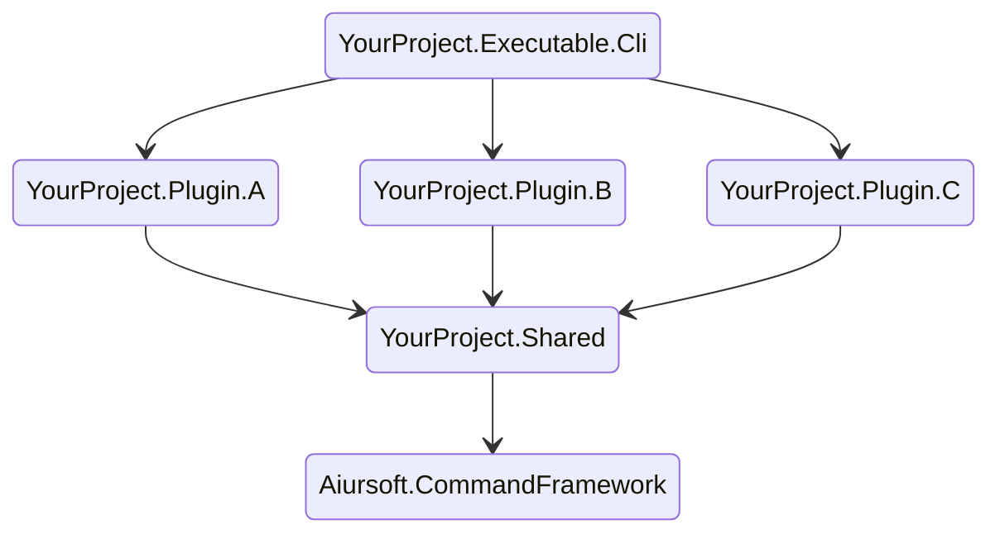

# Nested Commands App

```bash
dotnet add package Aiursoft.CommandFramework
```

Suggested project dependency tree (This will make your executable cli easy to be extended by plugins.):



First, write a simple class to provide options to your command:

```csharp
using System.CommandLine;
using Aiursoft.CommandFramework.Models;

public static class OptionsProvider
{
    public static RootCommand AddGlobalOptions(this RootCommand command)
    {
        var options = new Option[]
        {
            CommonOptionsProvider.DryRunOption,
            CommonOptionsProvider.VerboseOption
        };
        foreach (var option in options)
        {
            command.AddGlobalOption(option);
        }
        return command;
    }
}
```

In your `YourProject.ExecutableCli`, write the program entry like this:

```csharp
// Program.cs
using Aiursoft.CommandFramework;
using Aiursoft.CommandFramework.Extensions;

return await new AiursoftCommandApp()
    .Configure(command =>
    {
        command
            .AddGlobalOptions()
            .AddPlugins(new CalendarPlugin());
    })
    .RunAsync(args);
```

Yes, I know you need to write plugins for your executable!

Now try to write a plugin:

```csharp
using System.CommandLine;
using Aiursoft.CommandFramework.Abstracts;
using Aiursoft.CommandFramework.Framework;
using Aiursoft.CommandFramework.Models;
using Aiursoft.CommandFramework.Services;
using Microsoft.Extensions.DependencyInjection;

public class CalendarPlugin : IPlugin
{
    public CommandHandler[] Install()
    {
        return new CommandHandler[]
        {
            new CalendarHandler(),
        };
    }
}


public class CalendarHandler : CommandHandler
{
    public override string Name => "calendar";

    public override string Description => "Show calendar.";

    public override void OnCommandBuilt(Command command)
    {
        command.SetHandler(
            Execute, CommonOptionsProvider.VerboseOption);
    }

    private async Task Execute(bool verbose)
    {
        var host = ServiceBuilder
            .BuildHost<Startup>(verbose)
            .Build();

        await host.StartAsync();
        
        var calendar = host.Services.GetRequiredService<CalendarRenderer>();
        calendar.Render();
    }
}

public class Startup : IStartUp
{
    public void ConfigureServices(IServiceCollection services)
    {
        services.AddScoped<CalendarRenderer>();
    }
}

public class CalendarRenderer
{
    public void Render()
    {
        Console.WriteLine("Hello world!");
    }
}
```

That's it!

```bash
$ yourapp calendar
Hello world!
```

## Advanced Usage 1 - Nested Command Handler

Of course, handlers can be nested:

```csharp
public class GetHandler : CommandHandler
{
    public override string Name => "get";

    public override string Description => "Get something.";

    public override CommandHandler[] GetSubCommandHandlers()
    {
        return new CommandHandler[]
        {
            new DataHandler(),
            new HistoryHandler(),
            new CalendarHandler()
        };
    }
}
```

When your app starts, it just works!

```bash
$ yourapp get calendar
Hello world!
```

## Advanced Usage 2 - More options for a specific command

Of course, you can add more options to a specific command:

```csharp
using Microsoft.Extensions.DependencyInjection;
using Microsoft.Extensions.Hosting;
using System.CommandLine;
using Aiursoft.CommandFramework.Framework;
using Aiursoft.CommandFramework.Services;

public class TranslateHandler : CommandHandler
{
    private readonly Option<string> _bingApiKey = new(
        aliases: new[] { "--key", "-k" },
        description: "The Bing API Key.")
    {
        IsRequired = true
    };

    private readonly Option<string> _targetLang = new(
        aliases: new[] { "--language", "-l" },
        description: "The target language code. For example: zh, en, ja")
    {
        IsRequired = true
    };

    public override string Name => "translate";

    public override string Description => "The command to start translation based on Bing Translate.";

    public override Option[] GetCommandOptions()
    {
        return new Option[]
        {
            _bingApiKey,
            _targetLang
        };
    }

    public override void OnCommandBuilt(Command command)
    {
        command.SetHandler(
            Execute,
            OptionsProvider.PathOptions,
            OptionsProvider.DryRunOption,
            OptionsProvider.VerboseOption,
            _bingApiKey,
            _targetLang);
    }

    private Task Execute(string path, bool dryRun, bool verbose, string key, string targetLang)
    {
        var hostBuilder = ServiceBuilder.BuildHost<StartUp>(verbose);

        hostBuilder.ConfigureServices(services =>
        {
            services.Configure<TranslateOptions>(options =>
            {
                options.BingApiKey = key;
                options.TargetLang = targetLang;
            });
        });

        var entry = hostBuilder
            .Build()
            .Services
            .GetRequiredService<TranslateEntry>(); // TranslateEntry is a class that injects 'IOptions<TranslateOptions>'.

        return entry.OnServiceStartedAsync(path, !dryRun);
    }
}

```

Now you have more options to use:

```bash
$ yourapp translate --key AB123 --language zh-CN
```
