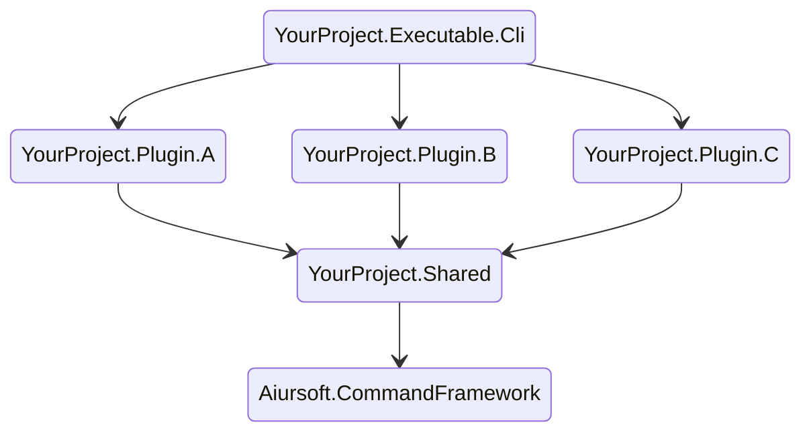

# Aiursoft CommandFramework

[](https://gitlab.aiursoft.cn/aiursoft/commandframework/-/blob/master/LICENSE)
[](https://gitlab.aiursoft.cn/aiursoft/commandframework/-/pipelines)
[](https://gitlab.aiursoft.cn/aiursoft/commandframework/-/pipelines)
[](https://www.nuget.org/packages/Aiursoft.CommandFramework/)
[](https://gitlab.aiursoft.cn/aiursoft/commandframework/-/commits/master?ref_type=heads)

Aiursoft CommandFramework is a framework for building command line tools.

* Auto argument parsing
* Auto help page generation
* Auto version page generation

With this framework, you can build a command line tool with just a few lines of code.

Example project it built:

* [Nuget Ninja](https://gitlab.aiursoft.cn/aiursoft/nugetninja)
* [DotDownload](https://gitlab.aiursoft.cn/aiursoft/dotdownload)
* [Parser](https://gitlab.aiursoft.cn/anduin/parser)
* [HappyRecorder](https://gitlab.aiursoft.cn/anduin/happyrecorder)
* [Dotlang](https://gitlab.aiursoft.cn/aiursoft/dotlang)
* [Ni Bot](https://gitlab.aiursoft.cn/aiursoft/ni-bot)
* [IPMI Controller](https://gitlab.aiursoft.cn/aiursoft/ipmicontroller)

```bash
C:\workspace> ninja.exe

Description:
  Nuget Ninja, a tool for detecting dependencies of .NET projects.

Usage:
  Microsoft.NugetNinja [command] [options]

Options:
  -p, --path <path> (REQUIRED)   Path of the projects to be changed.
  --nuget-server <nuget-server>  If you want to use a customized nuget server instead of the official nuget.org, 
  --token <token>                The PAT token which has privilege to access the nuget server.
  -d, --dry-run                  Preview changes without actually making them
  -v, --verbose                  Show detailed log
  -?, -h, --help                 Show help and usage information

Commands:
  all, all-officials  The command to run all officially supported features.
  remove-deprecated   The command to replace all deprecated packages to new packages.
  upgrade-pkg         The command to upgrade all package references to possible latest and avoid conflicts.
  clean-pkg           The command to clean up possible useless package references.
  clean-prj           The command to clean up possible useless project references.
  ```

## Why this project?

Command-line applications are a great way to automate repetitive tasks or even to be your own productivity tool. But building a command-line application in .NET is not easy. You need to parse the arguments, generate help pages, and so on. This project is designed to help you build a command-line application with just a few lines of code.

## Installation

Run the following command to install `Aiursoft.CommandFramework` to your project from [nuget.org](https://www.nuget.org/packages/Aiursoft.CommandFramework/):

```bash
dotnet add package Aiursoft.CommandFramework
```

Suggested project dependency tree (This will make your executable cli easy to be extended by plugins.):



First, write a simple class to provide options to your command:

```csharp
using System.CommandLine;
using Aiursoft.CommandFramework.Models;

public static class OptionsProvider
{
    public static RootCommand AddGlobalOptions(this RootCommand command)
    {
        var options = new Option[]
        {
            CommonOptionsProvider.DryRunOption,
            CommonOptionsProvider.VerboseOption
        };
        foreach (var option in options)
        {
            command.AddGlobalOption(option);
        }
        return command;
    }
}
```

In your `YourProject.ExecutableCli`, write the program entry like this:

```csharp
// Program.cs
using Aiursoft.CommandFramework;
using Aiursoft.CommandFramework.Extensions;

return await new AiursoftCommand()
    .Configure(command =>
    {
        command
            .AddGlobalOptions()
            .AddPlugins(new CalendarPlugin());
    })
    .RunAsync(args);
```

Yes, I know you need to write plugins for your executable!

Now try to write a plugin:

```csharp
using System.CommandLine;
using Aiursoft.CommandFramework.Abstracts;
using Aiursoft.CommandFramework.Framework;
using Aiursoft.CommandFramework.Models;
using Aiursoft.CommandFramework.Services;
using Microsoft.Extensions.DependencyInjection;

public class CalendarPlugin : IPlugin
{
    public CommandHandler[] Install()
    {
        return new CommandHandler[]
        {
            new CalendarHandler(),
        };
    }
}


public class CalendarHandler : CommandHandler
{
    public override string Name => "calendar";

    public override string Description => "Show calendar.";

    public override void OnCommandBuilt(Command command)
    {
        command.SetHandler(
            Execute, CommonOptionsProvider.VerboseOption);
    }

    private async Task Execute(bool verbose)
    {
        var host = ServiceBuilder
            .BuildHost<Startup>(verbose)
            .Build();

        await host.StartAsync();
        
        var calendar = host.Services.GetRequiredService<CalendarRenderer>();
        calendar.Render();
    }
}

public class Startup : IStartUp
{
    public void ConfigureServices(IServiceCollection services)
    {
        services.AddScoped<CalendarRenderer>();
    }
}

public class CalendarRenderer
{
    public void Render()
    {
        Console.WriteLine("Hello world!");
    }
}
```

That's it!

```bash
$ yourapp calendar
Hello world!
```

## Advanced Usage 1 - Nested Command Handler

Of course, handlers can be nested:

```csharp
public class GetHandler : CommandHandler
{
    public override string Name => "get";

    public override string Description => "Get something.";

    public override CommandHandler[] GetSubCommandHandlers()
    {
        return new CommandHandler[]
        {
            new DataHandler(),
            new HistoryHandler(),
            new CalendarHandler()
        };
    }
}
```

When your app starts, it just works!

```bash
$ yourapp get calendar
Hello world!
```

## Advanced Usage 2 - More options

Of course, you can add more options to a specific command:

```csharp
using Microsoft.Extensions.DependencyInjection;
using Microsoft.Extensions.Hosting;
using System.CommandLine;
using Aiursoft.CommandFramework.Framework;
using Aiursoft.CommandFramework.Services;

public class TranslateHandler : CommandHandler
{
    private readonly Option<string> _bingApiKey = new(
        aliases: new[] { "--key", "-k" },
        description: "The Bing API Key.")
    {
        IsRequired = true
    };

    private readonly Option<string> _targetLang = new(
        aliases: new[] { "--language", "-l" },
        description: "The target language code. For example: zh, en, ja")
    {
        IsRequired = true
    };

    public override string Name => "translate";

    public override string Description => "The command to start translation based on Bing Translate.";

    public override Option[] GetCommandOptions()
    {
        return new Option[]
        {
            _bingApiKey,
            _targetLang
        };
    }

    public override void OnCommandBuilt(Command command)
    {
        command.SetHandler(
            Execute,
            OptionsProvider.PathOptions,
            OptionsProvider.DryRunOption,
            OptionsProvider.VerboseOption,
            _bingApiKey,
            _targetLang);
    }

    private Task Execute(string path, bool dryRun, bool verbose, string key, string targetLang)
    {
        var hostBuilder = ServiceBuilder.BuildHost<StartUp>(verbose);

        hostBuilder.ConfigureServices(services =>
        {
            services.Configure<TranslateOptions>(options =>
            {
                options.BingApiKey = key;
                options.TargetLang = targetLang;
            });
        });

        var entry = hostBuilder
            .Build()
            .Services
            .GetRequiredService<TranslateEntry>(); // TranslateEntry is a class that injects 'IOptions<TranslateOptions>'.

        return entry.OnServiceStartedAsync(path, !dryRun);
    }
}

```

Now you have more options to use:

```bash
$ yourapp translate --key AB123 --language zh-CN
```

## Advanced Usage 3 - Write tests

If you want to write tests for your command line tool, you can use `TestRunAsync` method to invoke your command:

```csharp
using Aiursoft.CommandFramework;
using Aiursoft.CommandFramework.Extensions;
using Microsoft.VisualStudio.TestTools.UnitTesting;

[TestClass]
public class IntegrationTests
{
    private readonly AiursoftCommand _program;

    public IntegrationTests()
    {
        _program = new AiursoftCommand()
            .Configure(command =>
            {
                command
                    .AddGlobalOptions()
                    .AddPlugins(
                        // Your plugins
                    );
            });
    }

    [TestMethod]
    public async Task InvokeHelp()
    {
        var result = await _program.TestRunAsync(new[] { "--help" });

        Assert.AreEqual(0, result.ProgramReturn);
        Assert.IsTrue(result.Output.Contains("Options:"));
        Assert.IsTrue(string.IsNullOrWhiteSpace(result.Error));
    }

    [TestMethod]
    public async Task InvokeVersion()
    {
        var result = await _program.TestRunAsync(new[] { "--version" });
        Assert.AreEqual(0, result.ProgramReturn);
    }

    [TestMethod]
    public async Task InvokeUnknown()
    {
        var result = await _program.TestRunAsync(new[] { "--wtf" });
        Assert.AreEqual(1, result.ProgramReturn);
    }

    [TestMethod]
    public async Task InvokeWithoutArg()
    {
        var result = await _program.TestRunAsync(Array.Empty<string>());
        Assert.AreEqual(1, result.ProgramReturn);
    }
}
```

## Download a real sample project

If you want to explore a real project built with this framework, please check [Parser](https://gitlab.aiursoft.cn/anduin/parser) as an example.

## How to contribute

There are many ways to contribute to the project: logging bugs, submitting pull requests, reporting issues, and creating suggestions.

Even if you with push rights on the repository, you should create a personal fork and create feature branches there when you need them. This keeps the main repository clean and your workflow cruft out of sight.

We're also interested in your feedback on the future of this project. You can submit a suggestion or feature request through the issue tracker. To make this process more effective, we're asking that these include more information to help define them more clearly.
